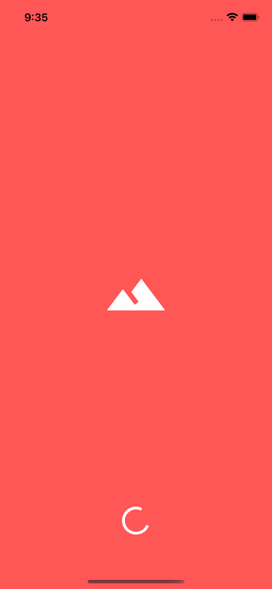

# FLUTTER CODELABS / BUILDING LAYOUTS IN FLUTTER (PT.1)

- https://romanjustcodes.web.app/#/workshops

| | | |
| --- | --- | --- |
|  |  |  |

## Development💻

- Flutter 2.10.3

## Getting Started🚀

- `flutter pub get`
- `flutter run`
